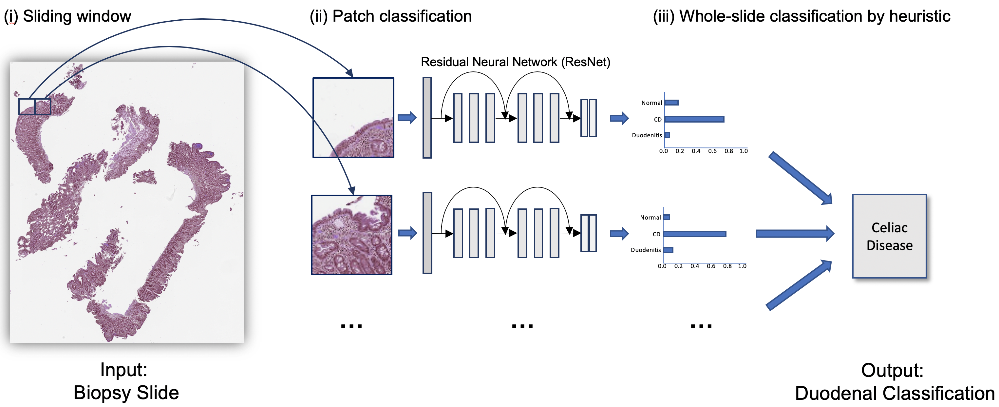
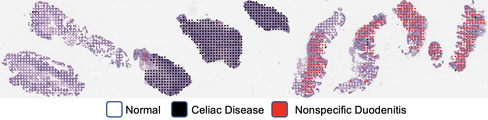

# DeepSlide: A Sliding Window Framework for Classification of High Resolution Microscopy Images (Whole-Slide Images)

This repository is a sliding window framework for classification of high resolution whole-slide images, often called microscopy or histopathology images. This is also the code for the paper [Pathologist-level Classification of Histologic Patterns on Resected Lung Adenocarcinoma Slides with Deep Neural Networks](https://www.nature.com/articles/s41598-019-40041-7). For a practical guide and implementation tips, see the Medium post [Classification of Histopathology Images with Deep Learning: A Practical Guide](https://medium.com/health-data-science/classification-of-histopathology-images-with-deep-learning-a-practical-guide-2e3ffd6d59c5). 

We have made 143 digitized high-resolution histology slides of lung adenocarcinoma in the test set and their predominant subtypes according to the consensus opinion of three pathologists at Dartmouth-Hitchcock Medical Center publicly available. More information about this dataset and instructions on how to download are provided on the [dataset webpage](https://bmirds.github.io/LungCancer).

*For questions about our code, please open an issue on this code repository.*




## Requirements
- [imageio](https://pypi.org/project/imageio/)
- [NumPy 1.16+](https://numpy.org/)
- [OpenCV](https://opencv.org/)
- [OpenSlide](https://openslide.org/)
- [OpenSlide Python](https://openslide.org/api/python/)
- [pandas](https://pandas.pydata.org/)
- [PIL](https://pillow.readthedocs.io/en/5.3.x/)
- [Python 3.7+](https://www.python.org/downloads/release/python-360/)
- [PyTorch](https://pytorch.org/)
- [scikit-image](https://scikit-image.org/)
- [scikit-learn](https://scikit-learn.org/stable/install.html)
- [SciPy](https://www.scipy.org/)
- [NVIDIA GPU](https://www.nvidia.com/en-us/)
- [Ubuntu](https://ubuntu.com/)

## Installing Dependencies (Recommended method)

`conda env create --file setup/conda_env.yaml`

This command creates a conda environment called 'deepslide_env' with Python 3.9 and PyTorch with CUDA 11.3. Please modify the environment file(s) for other versions.

In addition, `install_openslide.sh` installs dependencies of OpenSlide package in Ubuntu. For other platforms, please visit to the OpenSlide's official website for more information.

# Usage

Take a look at `code/config.py` before you begin to get a feel for what parameters can be changed.

## 1. Train-Val-Test Split:

Splits the data into a validation and test set. Default validation whole-slide images (WSI) per class is 20 and test images per class is 30. You can change these numbers by changing the `--val_wsi_per_class` and `--test_wsi_per_class` flags at runtime. You can skip this step if you did a custom split (for example, you need to split by patients).

```
python code/1_split.py
```

If you do not want to duplicate the data, append `--keep_orig_copy False` to the above command.

**Inputs**: `all_wsi` 

**Outputs**: `wsi_train`, `wsi_val`, `wsi_test`, `labels_train.csv`, `labels_val.csv`, `labels_test.csv`

Note that `all_wsi` must contain subfolders of images labeled by class. For instance, if your two classes are `a` and `n`, you must have `a/*.jpg` with the images in class `a` and `n/*.jpg` with images in class `n`.

If you already have a patch-based preprocessed dataset, you may skip to Stage 3 for model training. Please make sure that at least:

1. `all_wsi` has a folder for each class as a placeholder (they can be empty).

2. Both `train_folder/train` and `train_folder/val` folders contain a folder for each class and each slide that belongs to its partition. The slide folder should contain at least one patch extracted from the slide (e.g., `train_folder/train/<class_name>/<slide_name>/<patch_file>`).

3. Review `code/config.py` and make appropriate/necessary changes for your dataset.

### Example
```
python code/1_split.py --val_wsi_per_class 10 --test_wsi_per_class 20
```

## 2. Data Processing

- Generate patches for the training set.
- Balance the class distribution for the training set.
- Generate patches for the validation set.
- Generate patches by folder for WSI in the validation set.
- Generate patches by folder for WSI in the testing set.

```
python code/2_process_patches.py
```

Note that this will take up a significant amount of space. Change `--num_train_per_class` to be smaller if you wish not to generate as many windows. If your histopathology images are H&E-stained, whitespace will automatically be filtered. Turn this off using the option `--type_histopath False`. Default overlapping area is 1/3 for test slides. Use 1 or 2 if your images are very large; you can also change this using the `--slide_overlap` option.

**Inputs**: `wsi_train`, `wsi_val`, `wsi_test`

**Outputs**: `train_folder` (fed into model for training), `patches_eval_train` (for validation, sorted by WSI), `patches_eval_test` (for testing, sorted by WSI)

### Example
```
python code/2_process_patches.py --num_train_per_class 20000 --slide_overlap 2
```


## 3. Model Training

```
CUDA_VISIBLE_DEVICES=0 python code/3_train.py
```

We recommend using ResNet-18 if you are training on a relatively small histopathology dataset. You can change hyperparameters using the `argparse` flags. There is an option to retrain from a previous checkpoint. Model checkpoints are saved by default every epoch in `checkpoints`.

**Inputs**: `train_folder`

**Outputs**: `checkpoints`, `logs`

### Example
```
CUDA_VISIBLE_DEVICES=0 python code/3_train.py --batch_size 32 --num_epochs 100 --save_interval 5
```

## 4. Testing on WSI

Run the model on all the patches for each WSI in the validation and test set.

```
CUDA_VISIBLE_DEVICES=0 python code/4_test.py
```

We automatically choose the model with the best validation accuracy. You can also specify your own. You can change the thresholds used in the grid search by specifying the `threshold_search` variable in `code/config.py`.

**Inputs**: `patches_eval_val`, `patches_eval_test`

**Outputs**: `preds_val`, `preds_test`

### Example
```
CUDA_VISIBLE_DEVICES=0 python code/4_test.py --auto_select False
```


## 5. Searching for Best Thresholds

The simplest way to make a whole-slide inference is to choose the class with the most patch predictions. We can also implement thresholding on the patch level to throw out noise. To find the best thresholds, we perform a grid search. This function will generate csv files for each WSI with the predictions for each patch.

```
python code/5_grid_search.py
```

**Inputs**: `preds_val`, `labels_val.csv`

**Outputs**: `inference_val`

### Example
```
python code/5_grid_search.py --preds_val different_labels_val.csv
```

## 6. Visualization

A good way to see what the network is looking at is to visualize the predictions for each class.

```
python code/6_visualize.py
```

**Inputs**: `wsi_val`, `preds_val`

**Outputs**: `vis_val`

You can change the colors in `colors` in `code/config.py`



### Example
```
python code/6_visualize.py --vis_test different_vis_test_directory
```


## 7. Final Testing

Do the final testing to compute the confusion matrix on the test set.

```
python code/7_final_test.py
```

**Inputs**: `preds_test`, `labels_test.csv`, `inference_val` and `labels_val` (for the best thresholds)

**Outputs**: `inference_test` and confusion matrix to stdout

### Example
```
python code/7_final_test.py --labels_test different_labels_test.csv
```

Best of luck.

# Quick Run

If you want to run all code and change the default parameters in `code/config.py`, run
```
sh code/run_all.sh
```
and change the desired flags on each line of the `code/run_all.sh` script.


# Pre-Processing Scripts

See `code/z_preprocessing` for some code to convert images from svs into jpg. This uses OpenSlide and takes a while. How much you want to compress images will depend on the resolution that they were originally scanned, but a guideline that has worked for us is 3-5 MB per WSI.

# Known Issues and Limitations
- Only 1 GPU supported.
- Should work, but not tested on Windows.
- In cases where no crops are found for an image, empty directories are created. Current workaround uses `try` and `except` statements to catch errors.
- Image reading code expects colors to be in the RGB space. Current workaround is to keep first 3 channels.
- This code will likely work better when the labels are at the tissue level. It will still work for the entire WSI, but results may vary.

# Still not working? Consider the following...

- Ask a pathologist to look at your visualizations.
- Make your own heuristic for aggregating patch predictions to determine the WSI-level classification. Often, a slide thats 20% abnormal and 80% normal should be classified as abnormal.
- If each WSI can have multiple types of lesions/labels, you may need to annotate bounding boxes around these.
- Did you pre-process your images? If you used raw .svs files that are more than 1GB in size, its likely that the patches are way too zoomed in to see any cell structures.
- If you have less than 10 WSI per class in the training set, obtain more.
- Feel free to view our end-to-end attention-based model in JAMA Network Open: [https://jamanetwork.com/journals/jamanetworkopen/fullarticle/2753982](https://jamanetwork.com/journals/jamanetworkopen/fullarticle/2753982).

# Future Work

- Contributions to this repository are welcome. 
- Code for generating patches on the fly instead of storing them in memory for training and testing would save a lot of disk space.
- If you have issues, please post in the issues section and we will do our best to help.

# Citations

DeepSlide is an open-source library and is licensed under the [GNU General Public License (v3)](https://www.gnu.org/licenses/gpl-3.0.en.html). If you are using this library please cite:

```Jason Wei, Laura Tafe, Yevgeniy Linnik, Louis Vaickus, Naofumi Tomita, Saeed Hassanpour, "Pathologist-level Classification of Histologic Patterns on Resected Lung Adenocarcinoma Slides with Deep Neural Networks", Scientific Reports;9:3358 (2019).```

